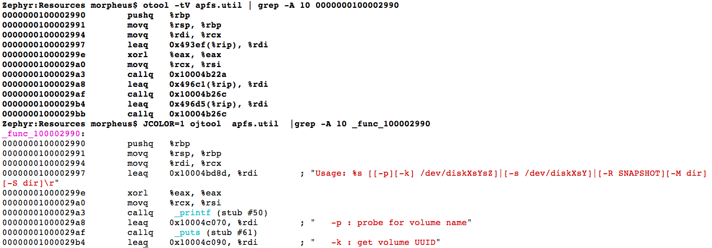
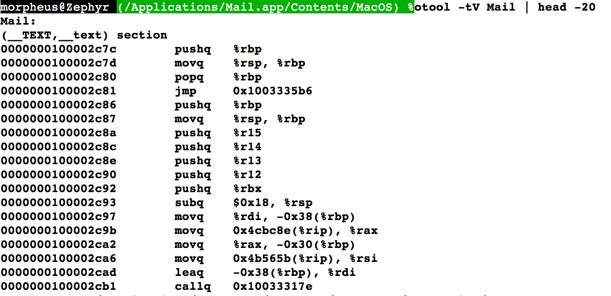

# OJTool - Putting the J into otool(1)
##### 原文：[OJTool - Putting the J into otool(1)](http:/www.newosxbook.com/tools/ojtool.html)
## 这是什么？
你可能熟悉我的jtool，其中一个限制是我没有完全实现Intel的反汇编。那就是为何当你们坚持编写自己的反编译器而不使用radare/capstone等其他开源框架。

苹果的otool是不好用的(大多时候)。有时它会得到文字，有时它不会。截至10.12，后者比较多。是的，你能使用HOpper/IDA/etc,但是有时候用命令行(...|grep...)快速反编译没有什么能比上otool。不过它有个恼人的记号法——xxxx(%rip)，所以还要自己算出ip相对地址是什么，对吧？

所以我为它写了一个简单的过滤器，它运行otool，然后缓存输出，查找xxx%(rip)和它下一行指令的IP值，然后执行简单的16进制加法。

依鄙人之见，有些东西应该已经通过一些开关实现了(免责 - 也许是吧？我没有费心去深入研究otool的-tV传参)。但后来我想，为什么不把它与jtool结合呢？
注意：

<table>
<tr>
<td>
<pre>
Zephyr:Work morpheus$ otool -tV /bin/ls | tail -10
00000001000043f1        pushq   %rbp
00000001000043f2        movq    %rsp, %rbp
00000001000043f5        movq    0xc14(%rip), %rax
00000001000043fc        movq    (%rax), %rcx
00000001000043ff        leaq    0xb20(%rip), %rdi
0000000100004406        movl    $0x3e, %esi
000000010000440b        movl    $0x1, %edx
0000000100004410        callq   0x1000044f2
0000000100004415        movl    $0x1, %edi
000000010000441a        callq   0x1000044b6
</pre>
</td>
<td>
<pre>
Zephyr:Work morpheus$ ./otoolfilt /bin/ls | tail -10
00000001000043f1        pushq   %rbp
00000001000043f2        movq    %rsp, %rbp
00000001000043f5        movq    0x100005010, %rax
00000001000043fc        movq    (%rax), %rcx
<span style="color: red">00000001000043ff        leaq    0x100004f26, %rdi ;  usage: ls [-ABCFGHLOPRSTUWabcdefghiklmnopqrstuwx1] [file ...]\r;</span>
0000000100004406        movl    $0x3e, %esi
000000010000440b        movl    $0x1, %edx
0000000100004410        callq   0x1000044f2
0000000100004415        movl    $0x1, %edi
000000010000441a        callq   0x1000044b6
</pre>
</tr>
</table>

如果otool的文字检测每次都正常运行的话(你懂的，从文字池获取内容作为注释)这样做是没必要的。它只有时候起作用，并且到10.12为止大部分时没作用。因此比起修复这个问题它更适合用过滤器来做。

## 新功能(4/29/2017)

- 检查jtool -function_starts 提供函数边界显示
- 将存根相关联jtool -lazy_bind以带回外部调用符号表
- 更好的字符串支持
- 基本颜色支持

一图道千言


## Obj-C和companin file支持（05/26/2017）
我在一次MacOS应用逆向的培训中遇到了一个问题然后我引入了两个快速hack的重要方法到ojtool：

- **Objective-C支持:**有/没有companion file，ojtool将获取所有__DATA.__objc* section和__got数据。**注意这是一个hack类别，它对ojtool性能有点影响**，但是值得的
<table>
<tr>
<td>

</td>
<td>

</tr>
</table>
- **Companion file支持:**jtool仍然不会做intel反编译，但是你可以强制使用companion file创建，使用```--jtooldir dir -d __DATA.__const binary > /dev/null```。如果JTOOLDIR=指定路径(或者你在同一目录中)则companion file将被ojtool拾取。这个就可以设置你自己的symbols，包括全局变量，来符号化intel二进制文件，arm文件也一样。

## 哪儿获取
源地址:[ http://newosxbook.com/src.jl?tree=listings&file=otoolfilt.c]( http://newosxbook.com/src.jl?tree=listings&file=otoolfilt.c)

- 需要安装otool (/usr/bin, 默认路径)
- 如果想要字符串解析需要jtool
- 需要jtool版本高于Canberra的版本(即17年5月7日之后)。使用 ```jtool --version``` 查看编译日期。

## 评论/反馈

- 那些信赖unicorn/IDA/radare或者其它反编译工具的人。请告诉我它们多好，以及为什么它已经有这个功能了。
- **不意味着是安全的**。是的，有命令行注入，但是你已经在命令行了，那又怎样？如果你发现了**functional** bug(或者想要功能)，请通知我。
- 那些经常使用又不太情愿用otool的人，这个是为你做的。可能看起来不是很多用，但我觉得很有用。也许你也会。欢迎在[本书论坛](http://newosxbook.com/forum)留下你的反馈

## 顺便说一句，MOXiI 3出来了。但你可能已经知道了。